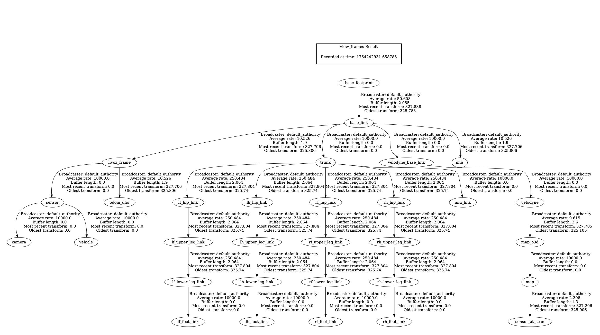
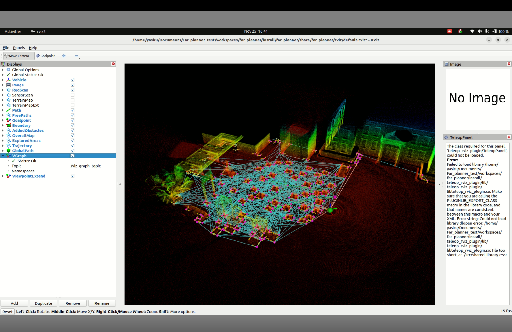

<p align="center">
  
</p>

<h1 align="center">Go2 Planner Suite</h1>

<p align="center">
  <strong>CUDA-Accelerated Autonomous Navigation for Unitree Go2 Quadruped Robot</strong>
</p>

<p align="center">
  <a href="#features">Features</a> •
  <a href="#architecture">Architecture</a> •
  <a href="#quick-start">Quick Start</a> •
  <a href="#cuda-acceleration">CUDA Acceleration</a> •
  <a href="#faq">FAQ</a>
</p>

---

## Overview

This repository contains a complete autonomous navigation stack for the **Unitree Go2** quadruped robot, featuring:

- **DLIO** - Direct LiDAR-Inertial Odometry with CUDA-accelerated GICP
- **Open3D SLAM** - Dense mapping and localization
- **Far Planner** - GPU-accelerated visibility graph planning
- **Terrain Analysis** - Real-time traversability assessment
- **Local Planner** - Reactive obstacle avoidance

---

## Architecture

<p align="center">
  
</p>

### Data Flow

```
LiDAR + IMU  -->  DLIO  -->  Open3D SLAM  -->  Terrain Analyzer  -->  Far Planner  -->  Local Planner  -->  Go2 Robot
                   |                                  |
              Odometry                         Terrain Map Ext
```

### TF Tree

<p align="center">
  
</p>

---

## Features

| Component | Description | Acceleration |
|-----------|-------------|--------------|
| **DLIO** | LiDAR-Inertial Odometry | CUDA (GICP) |
| **Far Planner** | Global path planning | CUDA (Visibility Graph) |
| **Boundary Handler** | Obstacle boundary processing | CUDA |
| **Terrain Analysis** | Traversability mapping | CPU + OpenMP |
| **Local Planner** | Reactive navigation | CPU |

---

## Visualization

### Simulation Environment

<p align="center">
  
</p>

### Visibility Graph (CUDA-Accelerated)

<p align="center">
  
</p>

The cyan lines show the **visibility graph** - navigation nodes that can "see" each other without obstacles. This computation is **GPU-accelerated** for real-time performance.

---

## Quick Start

### Prerequisites

- **ROS2 Humble**
- **CUDA 11.0+** (for GPU acceleration)
- **Unitree Go2 SDK** (for real robot)

### Installation

```bash
# Clone the repository
git clone https://github.com/Quadruped-dyn-insp/Go2_planner_suite.git
cd Go2_planner_suite

# Build all workspaces
./scripts/build.sh
```

### Launch (Simulation)

```bash
./scripts/sim.sh
```

### Launch (Real Robot)

```bash
./scripts/launch.sh
```

---

## CUDA Acceleration

### What's Accelerated?

#### 1. DLIO - GICP Registration

| Operation | CPU Time | GPU Time | Speedup |
|-----------|----------|----------|---------|
| Point Transform | O(N) seq | O(N/1024) parallel | ~100x |
| KNN Search | O(NxM) seq | O(NxM/1024) parallel | ~50x |
| Hessian Computation | O(N) seq | O(N/1024) parallel | ~100x |

#### 2. Far Planner - Visibility Graph

| Scenario | Nodes | Edges | CPU Time | GPU Time |
|----------|-------|-------|----------|----------|
| Small | 100 | 500 | 2.5 sec | 10 ms |
| Medium | 500 | 2000 | 4 min | 100 ms |
| Large | 1000 | 5000 | 42 min | 500 ms |

### Key CUDA Kernels

```cpp
// DLIO - Point cloud registration
__global__ void transformPointsKernel(...);
__global__ void knnSearchKernel(...);
__global__ void computeHessianKernel(...);

// Far Planner - Visibility checking
__global__ void ComputeVisibilityConnections(...);
__device__ bool IsEdgeCollidePolygons_GPU(...);
__device__ bool doIntersect_GPU(...);
```

---

## Project Structure

```
Go2_planner_suite/
├── scripts/
│   ├── build.sh              # Build all workspaces
│   ├── launch.sh             # Launch real robot
│   └── sim.sh                # Launch simulation
├── config/                   # Global configuration
├── docs/
│   ├── images/               # Documentation images
│   └── setup/                # Setup guides
└── workspaces/
    ├── autonomous_exploration/       # Mid-layer framework
    │   ├── local_planner/           # Reactive navigation
    │   ├── terrain_analysis/        # Traversability
    │   ├── loam_interface/          # Odometry bridge
    │   └── vehicle_simulator/       # Gazebo simulation
    ├── dlio/                        # CUDA-accelerated odometry
    │   └── src/nano_gicp/cuda/      # GICP CUDA kernels
    ├── far_planner/                 # CUDA-accelerated planner
    │   ├── far_planner/             # Core planner + CUDA
    │   └── boundary_handler/        # Boundary CUDA kernels
    ├── open3d_slam_ws/              # Dense mapping
    └── pipeline_launcher/           # System orchestration
```

---

## FAQ

### General

<details>
<summary><b>Q: What robot is this designed for?</b></summary>

**A:** Unitree Go2 quadruped robot with a Livox Mid-360 LiDAR and built-in IMU. It can be adapted for other robots by modifying the URDF and sensor configurations.
</details>

<details>
<summary><b>Q: Can I run this without a GPU?</b></summary>

**A:** Yes, but with reduced performance. The CUDA kernels have CPU fallbacks, but expect 10-100x slower planning and odometry in complex environments.
</details>

<details>
<summary><b>Q: What's the minimum GPU requirement?</b></summary>

**A:** Any CUDA-capable GPU with compute capability 6.0+ (Pascal or newer). Recommended: GTX 1060 or better for real-time performance.
</details>

### Odometry and Localization

<details>
<summary><b>Q: Why is my RViz display blank?</b></summary>

**A:** Check these in order:
1. Verify `/state_estimation` is publishing: `ros2 topic hz /state_estimation`
2. Check TF tree is connected: `ros2 run tf2_tools view_frames`
3. Set RViz Fixed Frame to `map`
4. Ensure `/registered_scan` has data: `ros2 topic echo /registered_scan --once`
</details>

<details>
<summary><b>Q: DLIO is not receiving IMU data?</b></summary>

**A:** Check:
1. IMU topic name matches config: `ros2 topic list | grep imu`
2. IMU data rate is sufficient (>100Hz recommended)
3. Timestamps are synchronized with LiDAR
</details>

<details>
<summary><b>Q: Open3D SLAM shows "Failed to add odometry pose to buffer"?</b></summary>

**A:** This means DLIO odometry isn't reaching Open3D SLAM. Verify:
1. DLIO is running and publishing `/odom_dlio`
2. Topic remapping is correct in launch file
3. Timestamps are valid (not zero)
</details>

### Planning

<details>
<summary><b>Q: The visibility graph has too many/few connections?</b></summary>

**A:** Adjust these parameters in Far Planner config:
- `nav_clear_dist`: Minimum clearance from obstacles (increase = fewer connections)
- `project_dist`: Maximum connection distance (decrease = fewer long connections)
</details>

<details>
<summary><b>Q: Path planning is slow even with GPU?</b></summary>

**A:** Check:
1. CUDA is actually being used: look for "CUDA available" in logs
2. Reduce number of navigation nodes if environment is too complex
3. Verify GPU isn't thermal throttling: `nvidia-smi`
</details>

<details>
<summary><b>Q: Robot doesn't follow the planned path?</b></summary>

**A:** The local planner may be overriding due to obstacles. Check:
1. `/terrain_map` shows correct obstacles
2. Local planner parameters aren't too aggressive
3. TF between `map` and `base_link` is accurate
</details>

### Simulation

<details>
<summary><b>Q: Gazebo crashes on startup?</b></summary>

**A:** Common fixes:
1. Install missing dependencies: `pip install lxml`
2. Kill zombie processes: `pkill -9 gzserver; pkill -9 gzclient`
3. Check GPU drivers: `nvidia-smi`
4. Reduce world complexity
</details>

<details>
<summary><b>Q: Robot falls through the ground in simulation?</b></summary>

**A:** Check:
1. Spawn height in launch file (should be ~0.275m for Go2)
2. Gazebo physics step size isn't too large
3. Contact sensor plugin is loaded
</details>

<details>
<summary><b>Q: Controller manager service not available?</b></summary>

**A:** The robot model didn't spawn correctly. Check:
1. `spawn_entity.py` completed without errors
2. URDF/Xacro files are valid
3. Gazebo plugins are installed
</details>

### Building and Dependencies

<details>
<summary><b>Q: CUDA compilation fails?</b></summary>

**A:** Ensure:
1. CUDA toolkit is installed: `nvcc --version`
2. Environment is set: `source /usr/local/cuda/bin/setup.sh`
3. CMake can find CUDA: check `CMAKE_CUDA_COMPILER`
4. GPU architecture matches: set `CMAKE_CUDA_ARCHITECTURES`
</details>

<details>
<summary><b>Q: Missing ROS2 packages?</b></summary>

**A:** Install common dependencies:

```bash
sudo apt install ros-humble-pcl-ros ros-humble-tf2-ros \
  ros-humble-nav-msgs ros-humble-geometry-msgs \
  ros-humble-gazebo-ros-pkgs
```
</details>

<details>
<summary><b>Q: Python module not found errors?</b></summary>

**A:** ROS2 Humble uses Python 3.10. If using conda:

```bash
conda deactivate  # Use system Python for ROS
# OR
pip install <package> --target=/opt/ros/humble/lib/python3.10/site-packages
```
</details>

---

## Configuration

### Key Parameters

| Parameter | File | Description |
|-----------|------|-------------|
| `sensor_frame` | DLIO config | LiDAR frame name |
| `nav_clear_dist` | Far Planner | Obstacle clearance |
| `terrain_resolution` | Terrain Analysis | Grid cell size |
| `local_planner_freq` | Local Planner | Control loop rate |

### Topic Remapping

```yaml
# Common remappings for real robot
/velodyne_points: /livox/lidar
/imu/data: /livox/imu
/odom: /odom_dlio
```

---

## Performance

### Benchmarks (RTX 3060, Intel i7-11800H)

| Module | Input Size | CPU Time | GPU Time |
|--------|------------|----------|----------|
| DLIO GICP | 10K points | 45 ms | 3 ms |
| Far Planner | 500 nodes | 240 sec | 0.1 sec |
| Terrain Analysis | 100K points | 15 ms | 15 ms* |

*Terrain analysis uses CPU+OpenMP (CUDA version planned)

---

## Contributing

1. Fork the repository
2. Create a feature branch: `git checkout -b feature/amazing-feature`
3. Commit changes: `git commit -m 'Add amazing feature'`
4. Push to branch: `git push origin feature/amazing-feature`
5. Open a Pull Request

---

## License

This project is licensed under the MIT License - see the [LICENSE](LICENSE) file for details.

---

## Acknowledgments

- [DLIO](https://github.com/vectr-ucla/direct_lidar_inertial_odometry) - Base odometry implementation
- [FAR Planner](https://github.com/MichaelFYang/far_planner) - Planning algorithms
- [Unitree Robotics](https://www.unitree.com/) - Go2 robot platform

---

<p align="center">
  <sub>Built for autonomous quadruped navigation</sub>
</p>
